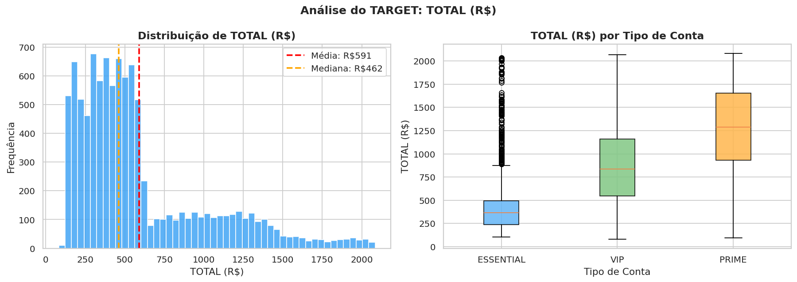
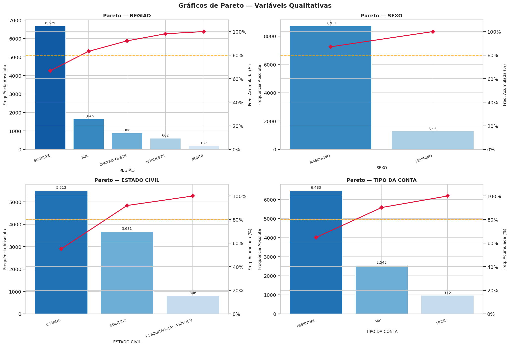
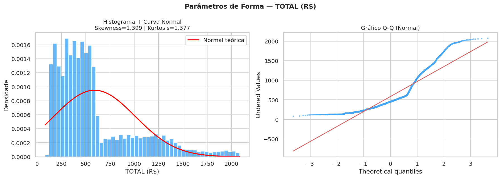

# EDA 
---

## Sobre o Projeto

Este projeto realiza uma **Análise Exploratória de Dados (EDA)** completa sobre um dataset do clube de vinhos UVVine, fornecido pelo professor da disciplina. O objetivo é extrair insights sobre o perfil dos clientes e o comportamento de gastos (`TOTAL R$`), passando pelas etapas de ETL, limpeza, análise estatística e redução de dimensionalidade.

O dataset contém **1.120.000 linhas** e **23 colunas**, incluindo dados demográficos dos clientes, características físico-químicas dos vinhos consumidos (médias por cliente) e o valor total gasto.

---

## Estrutura de Diretórios

```
estast-cien-dados/
├── apostilas/               
├── atividades/              
│   ├── atividade1.ipynb
│   ├── atividade2.ipynb
│   ├── atividade3.ipynb
│   └── atividade4.ipynb
├── data/
│   └── table16.csv         
├── figures/                 
├── venv/                   
├── .gitignore
├── requirements.txt
└── readme.md
```

> **Nota:** O arquivo `data/table16.csv` não é versionado por exceder o limite de 100MB do GitHub

---

## Configuração do Ambiente

### Usando `venv` (recomendado)

```bash
# Criar o ambiente virtual
python -m venv venv

# Ativar o ambiente (Linux/macOS)
source venv/bin/activate

# Instalar dependências
pip install -r requirements.txt
```

### Usando Anaconda

```bash
conda create -n bigdata_env python=3.12
conda activate bigdata_env
pip install pandas numpy matplotlib seaborn scipy jupyter ipykernel
```

### Registrar o kernel no Jupyter

```bash
python -m ipykernel install --user --name=venv_estast --display-name "Python (estast)"
```

### Executar o notebook

```bash
jupyter notebook "WORKFLOW - PARTE 1.ipynb"
```
## Prévia das Análises Gráficas

### Distribuição do TARGET: TOTAL (R$)

O gasto total apresenta **assimetria positiva** (cauda direita), com clientes PRIME exibindo valores significativamente maiores.



---

### Gráficos de Pareto — Variáveis Qualitativas

Frequências absolutas e acumuladas de REGIÃO, SEXO, ESTADO CIVIL e TIPO DA CONTA.



**Destaques:**
- Categoria predominante: **ESSENTIAL** (~65% dos clientes)
- Região com maior volume: **SUDESTE**
- Estado civil mais frequente: **CASADO**

---

### Parâmetros de Forma do TARGET

O gráfico Q-Q e o histograma evidenciam que `TOTAL (R$)` **não segue distribuição normal** (Skewness ≈ 1,40 | Kurtosis ≈ 1,38), justificando o uso de testes não-paramétricos.



